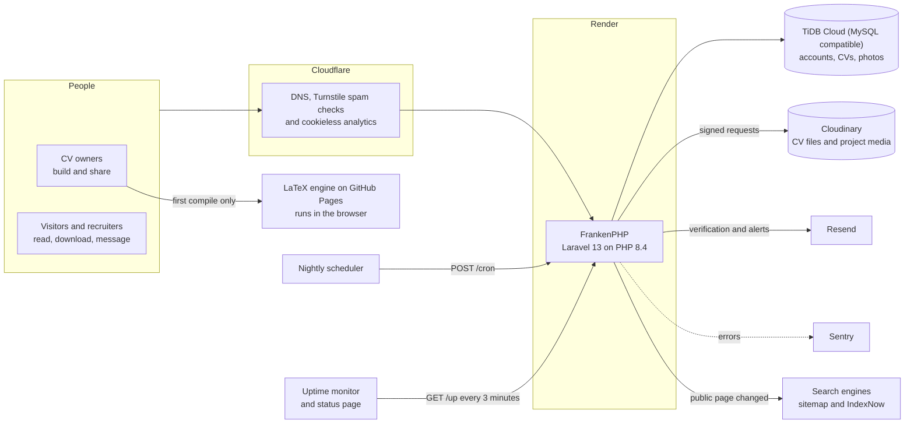

# Vitafolio

[](https://github.com/zaccesss/vitafolio/actions/workflows/ci.yml)
[](https://vitafolio.isaacadjei.me)
[](LICENSE)

Build, store and share every version of a CV, each with its own theme, privacy setting and link.


Vitafolio gives each person a profile and as many named CVs as they need: one for software roles, one
for research, one for a part-time job. Each CV can be public, unlisted or private. A CV can be built
in the editor or uploaded as a PDF or Word file. It can also be written in LaTeX and compiled in the
browser.

## Features

| Area | What it does |
| --- | --- |
| Profiles | A handle at `/@name`, a photo with a crop tool, a headline, links with recognised sites and a visibility setting |
| CVs | Up to ten per account, each with its own address, theme, accent colour, font, section order and visibility |
| Content | Rich sections, skills as tags, projects with images or short videos, an optional cover letter, JSON Resume import and export |
| Files | Uploaded PDF and Word files. LaTeX compiled in the browser with pdfLaTeX, XeLaTeX or LuaLaTeX |
| Sharing | A clean link, a QR code, generated PDF and Word files and a share image for each CV, plus private view counts. Generated PDFs are tagged PDF/UA-1 files that screen readers can follow. A cover letter shares its CV's link and privacy |
| Endorsements | People who know the owner's work can endorse a CV. Each one shows only after the owner approves it and only where the CV is visible |
| Directory | Public CVs listed with search, skill tags, availability and university filters |
| Sign-in | Email and password, passkeys, two-factor authentication, plus Google, GitHub and Microsoft |
| Safety | Ownership checks on every change, reports with a moderation queue, suspensions and a strict content security policy |
| Languages | The interface in English, Spanish, French, Brazilian Portuguese, Simplified Chinese, Arabic and Urdu, picked from the browser and a language menu, with right-to-left layouts for Arabic and Urdu. Each CV has its own document language for its labels, PDF and Word file |
| Accessibility | WCAG 2.2 AA colours in light and dark themes, full keyboard use, reduced motion and a plain CV layout |

## The name

Vitafolio is pronounced VEE-ta-FOH-lee-oh and joins two Latin words.

| Part | Root | Meaning |
| --- | --- | --- |
| VITA- | *vita*, as in *curriculum vitae* | life, the course of a life |
| -FOLIO | *folium* | a leaf or sheet of paper, the root behind *portfolio* |

Together they mean "the pages of a life": one place that holds every version of the record a CV tells.

## Stack

### Application

|  |  |  |  |
| :---: | :---: | :---: | :---: |
| **Laravel** | **PHP 8.4** | **MySQL** | **LaTeX** |

### Front end

|  |  |  |  |
| :---: | :---: | :---: | :---: |
| **Vue** | **Alpine.js** | **Tailwind CSS** | **Vite** |

### Hosting and storage

|  |  |  |  |
| :---: | :---: | :---: | :---: |
| **Docker** | **Render** | **Cloudflare** | **Cloudinary** |

### Email, monitoring and delivery

|  |  |  |
| :---: | :---: | :---: |
| **Resend** | **Sentry** | **GitHub Actions** |

Laravel Fortify handles accounts, two-factor authentication and passkeys. Laravel Socialite handles
the sign-in providers. Tagged PDFs come from Typst, images from GD and the server is FrankenPHP on Alpine
Linux. Each choice is explained in the [design decisions](docs/DOCUMENTATION.md#design-decisions).

## Architecture



## Running it locally

You need PHP 8.4 with the `gd`, `intl`, `pdo_mysql`, `zip` and `bcmath` extensions, Composer,
Node.js 26 and MySQL 8.

```sh
git clone https://github.com/zaccesss/vitafolio.git
cd vitafolio
composer install
npm ci
cp .env.example .env
php artisan key:generate
php artisan migrate
npm run build
php artisan serve
```

Then open `http://localhost:8000`, create an account and confirm it from the email written to
`storage/logs/laravel.log` (mail is logged rather than sent until a mailer is configured). Run
`php artisan vitafolio:make-admin you@example.com` to reach the moderation page.

> [!TIP]
> Every outside service is optional. Without its keys, a feature switches itself off: no sign-in
> buttons for unset providers, no media uploads without Cloudinary and no LaTeX compiling without
> the engine files. The rest of the site works as normal.

## Checks

```sh
php artisan test            # feature and unit tests on an in-memory database
vendor/bin/pint --test      # code style
vendor/bin/phpstan analyse  # static analysis
npm run build               # front-end build
```

## Documentation

- [Documentation](docs/DOCUMENTATION.md): architecture, data model, security, configuration, deployment and operations
- [Changelog](CHANGELOG.md), [roadmap](ROADMAP.md) and [accessibility](ACCESSIBILITY.md)
- [Contributing](CONTRIBUTING.md), [security policy](SECURITY.md) and [support](SUPPORT.md)

## Licence

Released under the [MIT Licence](LICENSE). The in-browser LaTeX engine is a separate component under
its own licence; see [NOTICE.md](NOTICE.md).
