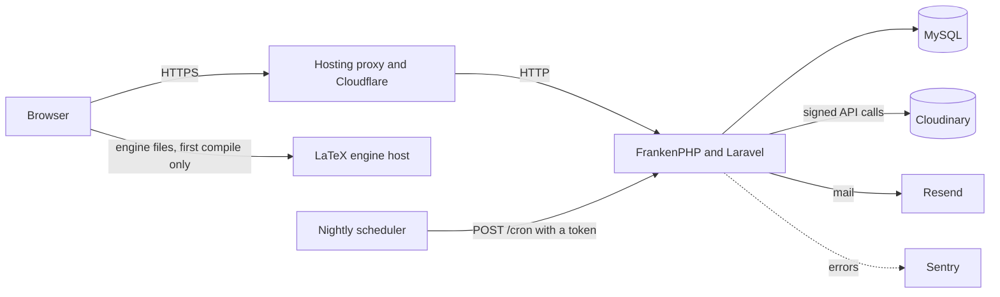
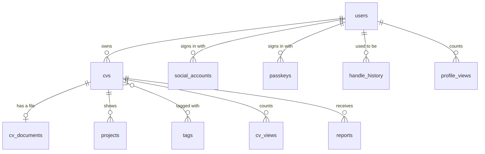

# Vitafolio documentation

Everything about Vitafolio in one place: how to use it, how it is built, how it keeps people's data
safe and how to run your own copy.

## Contents

- [Using Vitafolio](#using-vitafolio)
- [Architecture](#architecture)
- [Data model](#data-model)
- [Accounts and sign-in](#accounts-and-sign-in)
- [Profiles and handles](#profiles-and-handles)
- [CVs and visibility](#cvs-and-visibility)
- [Files, media and limits](#files-media-and-limits)
- [The LaTeX editor](#the-latex-editor)
- [Security](#security)
- [Privacy](#privacy)
- [Search and sharing](#search-and-sharing)
- [Configuration](#configuration)
- [Local development](#local-development)
- [Deployment](#deployment)
- [Operations](#operations)
- [Testing and quality checks](#testing-and-quality-checks)
- [Design decisions](#design-decisions)
- [Troubleshooting](#troubleshooting)
- [Frequently asked questions](#frequently-asked-questions)

## Using Vitafolio

### Getting started

1. Create an account with an email address and password. Where the site offers them, you can also
   continue with Google, GitHub or Microsoft.
2. Confirm your email address from the link sent to you. Nothing can be created until it is confirmed.
3. Your first CV, called "My CV", is ready on the **My CVs** page.

### Your profile

The **Profile** page holds what every CV shares: your photo, headline, bio, location, university,
availability and links. Choose a photo, frame it in the circle by dragging, zooming or using the arrow
keys, then upload it. Paste one link per line; well-known sites such as GitHub, LinkedIn, ORCID and
Google Scholar are named for you.

Your profile lives at `/@your-handle`. It can be public, unlisted (only people with the link) or
private.

### Building a CV

Each CV has six tabs:

| Tab | What you do there |
| --- | --- |
| Content | Headline, main language, profile, experience, education and skills, plus the order the sections appear in |
| Cover letter | An optional letter to send with this CV, with a line saying who it is for |
| Projects | Up to twelve projects with a link, a description and an image or short video |
| File and LaTeX | Upload a PDF or Word file. The LaTeX editor writes and compiles one instead |
| Look and privacy | Title, address, theme, accent colour, font, whether to show your email and who can see the CV |
| Import and export | Import a JSON Resume file, export this CV as JSON Resume, duplicate it or delete it |

Themes are Classic, Modern, Minimal and Plain. Plain is designed to be read easily by screen readers
and the applicant tracking systems employers use to scan CVs.

### Cover letters

Each CV can hold one cover letter, written on the **Cover letter** tab as plain paragraphs with a
blank line between them, up to 6,000 characters. An optional "Who it is for" line, such as the team
and role, sits above it. The letter is stored on the CV itself, so it always shares that CV's theme,
accent colour, font and visibility.

| Address | What it serves |
| --- | --- |
| `/cv/{address}/letter` | The letter as a web page, with a CV and Cover letter switch at the top |
| `/cv/{address}/letter/pdf` | The letter as a PDF in the same layout as the CV's PDF |
| `/cv/{address}/letter/word` | The letter as an editable Word document |

Every one of these addresses obeys the CV's own visibility rules, including moderator hiding, and
answers 404 while the letter is empty. A CV without a letter shows no switch and no letter links.

### Sharing a CV

Every CV has its own address. From the CV page you can copy the link, show a QR code for printed
copies, download a generated PDF and open any attached file. When the link is posted on a social site
or in a chat, a preview card shows your photo, name, headline and top skills.

On **My CVs**, each CV shows how many people viewed it over the last 30 days and which sites sent them.
Your own visits are never counted.

### Keeping your account safe

**Settings** (from the account menu in the top corner) has a page for each setting: public profile,
photo, handle, name and email, password and two-factor authentication, passkeys, connected accounts,
signed-in devices and your data, where you can download everything as JSON or delete your account.

### Analytics

**Analytics** (also from the account menu) shows CV views, profile views, PDF downloads and QR code
scans for the last 7, 30 or 90 days, with the previous period for comparison, views per CV, where
visitors came from and the busiest day. Every chart has a table with the same numbers. Each visitor
counts once a day, using a code that changes daily. Your own visits never count.

### Help and documentation

The **Help centre** at `/help` has guides for every part of the site and a search box. `/features`,
`/contact`, `/changelog` and `/docs` (this document) are linked from the footer.

## Architecture

Vitafolio is a server-rendered Laravel application. Pages are Blade templates styled with Tailwind CSS.
Small interactive parts use Alpine.js. The few rich widgets (the LaTeX studio, the section order editor
and the photo cropper) are Vue components mounted as islands, so a page without one never downloads
Vue.

| Folder | Holds |
| --- | --- |
| `app/Http/Controllers` | One controller per area: CVs, the editor, projects, files, LaTeX, profiles, accounts, sign-in providers, site files and moderation |
| `app/Support` | Plain helpers: link parsing, images, Cloudinary, file storage, LaTeX templates, JSON Resume, view counts and IndexNow |
| `app/Policies` | `CvPolicy`, the single place that decides who may change a CV |
| `app/Console/Commands` | `vitafolio:make-admin` and `vitafolio:tidy` |
| `resources/views` | Blade pages and components, the PDF layout and plain-text emails |
| `resources/js` | Alpine components in `app.js` and the Vue islands in `components/` |
| `resources/latex` | The four LaTeX starter templates |
| `resources/brand` | SVG sources for every icon and share image, rendered by `scripts/brand-assets.sh` |
| `docker` | The FrankenPHP config, PHP settings and the start script used by the production image |

## Data model

| Table | Notes |
| --- | --- |
| `users` | Profile fields live here: handle, headline, bio, links, university, availability, photo and visibility. `role` is `member` or `admin`. `has_password` is false for accounts made through a sign-in provider until a password is set |
| `cvs` | Title, address (`slug`), content sections, saved section order, LaTeX source, theme, accent, font and visibility. `letter_to` and `cover_letter` hold the optional cover letter. `hidden_at` is set by moderators |
| `cv_documents` | One file per CV. `storage` says whether the bytes are on Cloudinary (`public_id`) or in the `data` column |
| `projects` | Up to twelve per CV, each with optional media on Cloudinary, its size and a description for people who cannot see it |
| `tags` and `cv_tag` | Skills, with spelling variants such as "JS" and "JavaScript" folded into one tag |
| `cv_views` | One row per visitor per CV per kind (view, QR scan, PDF download or file open) per day. The visitor is a salted daily hash, never an address |
| `profile_views` | The same, for profile pages |
| `reports` | Visitor reports with a reason, optional details and a hashed reporter |
| `social_accounts` | One row per connected provider, keyed by the provider's own id for the person |
| `passkeys` | One row per passkey, with its name and when it was last used |
| `handle_history` | Old handles, held for 30 days so they redirect and cannot be taken by someone else |

Every table has a primary key, so the schema runs on database hosts that require one.

## Accounts and sign-in

- **Passwords** need at least 10 characters with a letter and a number. Passwords found in known
  breaches are refused; only a short hash prefix leaves the server for that check.
- **Email verification** is required before anything can be created.
- **Two-factor authentication** uses an authenticator app with recovery codes.
- **Passkeys** sign in with a fingerprint, face or device PIN. Adding or removing one needs a password
  confirmed within the last three hours.
- **Sign-in providers** are Google, GitHub and Microsoft, with LinkedIn supported in the code. Each one only appears once its keys
  are set.

> [!IMPORTANT]
> A provider sign-in joins an existing account with the same email only when the provider confirms the
> address is verified. Google and LinkedIn say so explicitly and GitHub only shares verified addresses.
> Microsoft gives no such promise for every organisation, so it never joins an account by email; it can
> still be connected from the account page while signed in.

Two-factor accounts still answer their challenge after a provider sign-in. Suspended accounts are
refused on every route: password, passkey and provider. An account always keeps at least one way in,
so the last provider cannot be disconnected without a password or passkey.

## Profiles and handles

New accounts get a handle made from their name, such as `/@alex-morgan`. It can change once every 30
days. The old handle redirects to the new one for 30 days and nobody else can claim it during that
time, which stops someone taking over a known handle to pose as its previous owner. A list of reserved
words (such as `admin` and `support`) can never be used.

A profile can be public (listed and searchable), unlisted (link only) or private (owner only). A
private profile also takes its CVs out of the directory and out of search engines.

## CVs and visibility

| Setting | Directory | Opens by link | Search engines | Sitemap |
| --- | --- | --- | --- | --- |
| Public | Yes | Yes | Yes | Yes |
| Unlisted | No | Yes | No (`noindex`) | No |
| Private | No | Owner and admins only | No | No |
| Hidden by a moderator | No | Owner and admins only | No | No |

A CV's cover letter, with its PDF and Word downloads, follows exactly the same rules as the CV.

A public CV is also kept out of the directory and search when its owner's profile is private, their
email is unverified or the account is suspended. Owners and admins always see a banner saying which of
these applies.

## Files, media and limits

CV files (uploads and compiled LaTeX PDFs) are stored on Cloudinary as **authenticated** assets: their
addresses cannot be guessed and cannot be opened without a signature. Vitafolio checks the viewer may
see the CV, then fetches the file and passes it on, so a private CV's file stays private. Without
Cloudinary configured, files are stored in the database instead.

Project images and videos are public assets on Cloudinary, delivered in the best format for each
browser. Profile photos are re-encoded to a 600 pixel JPEG and stored in the database, because they are
small and appear on every directory card.

| Limit | Value |
| --- | --- |
| Storage per account (CV files plus project media) | 100 MB, set by `STORAGE_ALLOWANCE_MB` |
| CV file or compiled PDF | 5 MB |
| Project image | 5 MB, shrunk to 2,000 pixels on arrival |
| Project video | 25 MB and 90 seconds |
| Profile photo | 4 MB, up to 8,000 pixels a side |
| CVs per account | 10 |
| Projects per CV | 12 |

Every upload is checked by its content rather than its name: PDFs must start with the PDF signature
and Word files must be real `.docx` packages. Images are decoded and re-encoded, which drops anything
hidden inside them along with location and camera data. Phone photos are turned upright using their
EXIF tag first, so the crop tool and the stored photo always agree.

Deleting a file, a project, a CV or a whole account also deletes its copies on Cloudinary.

## The LaTeX editor

The editor uses CodeMirror for the source and [BusyTeX](https://github.com/TeXlyre/texlyre-busytex),
TeX Live compiled to WebAssembly, to compile in the browser with pdfLaTeX, XeLaTeX or LuaLaTeX. Nothing
is sent to a server until the owner saves. The engine files (about 120 MB, cached after the first
compile) are hosted separately and named by `LATEX_ASSETS_URL`.

Four starter templates fill in the owner's details: Classic, Compact, Modern and Academic. Saving
stores the source. When a compile has succeeded, saving also attaches the PDF as the CV's file.
`Ctrl+Enter` compiles and `Ctrl+S` saves (`Cmd` on a Mac). A plain text box can replace the code
editor for anyone who finds it easier with a screen reader.

## Security

| Measure | Detail |
| --- | --- |
| Ownership | `CvPolicy` is checked on every change to a CV, its projects, its file and its LaTeX |
| Content security policy | Scripts, styles and fonts load from the site only, with no inline code. Only the LaTeX page may run WebAssembly. Only the profile page may preview a chosen photo |
| Headers | `X-Frame-Options: DENY`, `nosniff`, a strict referrer policy, cross-origin opener isolation and HSTS over HTTPS |
| Uploaded files | Served with a sandbox policy, so a script inside a PDF cannot reach the site |
| Links | Only `http` and `https` links are kept. Each is labelled from its real address, so a lookalike cannot pose as a known site |
| Sessions | Stored in the database, encrypted and ended everywhere on suspension |
| Spam | Cloudflare Turnstile on sign-up and contact forms, a hidden honeypot field and rate limits |
| Container | Runs as an unprivileged user. CI scans the image, the PHP packages and the npm packages for known vulnerabilities on every pull request |
| Sessions and devices | Remember-me cookies last 30 days. A password reset signs every device out; a password change signs every other device out. Settings lists every signed-in device and can end any one |

| Rate limit | Allowance |
| --- | --- |
| Password sign-in | 5 a minute per email and address, 20 an hour per email, 60 an hour per address |
| Two-factor codes | 5 a minute per sign-in |
| Passkey attempts | 10 a minute per address |
| Uploads | 10 a minute per account |
| Messages to CV owners | 5 an hour and 20 a day per address |
| Reports | 5 an hour per address |
| PDF and file downloads | 6 a minute per address |

Report a vulnerability through the [security policy](../SECURITY.md). Never open a public issue for one.

## Privacy

- Visitors can message a CV's owner without seeing their email address. The owner sees the visitor's
  address only when they reply.
- View counts use a hash that changes daily, so a visitor cannot be followed from one day to the next.
- Site analytics, where enabled, are Cloudflare Web Analytics: no cookies and no tracking across sites.
- Photos from sign-in providers are copied once on request, never loaded from the provider's site.
- Every account can download all its data as JSON and delete itself, which removes its files too.

## Search and sharing

- **Sitemap** at `/sitemap.xml` lists the main pages, public profiles and public CVs. `robots.txt`
  points to it.
- **IndexNow** tells Bing, Yandex and other participating search engines when a public CV or profile
  changes, goes private or is deleted. It runs after the response, so saving is never slowed down.
  Google reads the sitemap instead.
- **Structured data** marks profiles and CVs up as a `ProfilePage` about a `Person`.
- **Share images** are generated for each CV with the photo, name, headline and top skills.
- **QR codes** point at each CV for printed copies.
- **`/.well-known/security.txt`** gives the security contact, with an expiry that renews itself.

## Configuration

Copy `.env.example` to `.env`. Laravel's own settings are documented there; these are Vitafolio's.

| Variable | Purpose |
| --- | --- |
| `SITE_OWNER_NAME`, `SITE_OWNER_URL` | Who runs this copy of the site, shown in the footer |
| `SITE_CONTACT_EMAIL`, `SITE_SECURITY_EMAIL` | Where contact messages go and the address in `security.txt` |
| `SITE_SOURCE_URL` | The public source code, linked from the footer |
| `MYSQL_ATTR_SSL_CA` | Path to the database's CA certificate when the host requires TLS |
| `RESEND_API_KEY` | Mail delivery when `MAIL_MAILER=resend` |
| `TURNSTILE_SITE_KEY`, `TURNSTILE_SECRET` | Spam protection on forms |
| `CF_BEACON_TOKEN` | Cloudflare Web Analytics |
| `CLOUDINARY_CLOUD_NAME`, `CLOUDINARY_API_KEY`, `CLOUDINARY_API_SECRET` | File and media storage |
| `LATEX_ASSETS_URL` | Where the LaTeX engine files are hosted |
| `GOOGLE_*`, `GITHUB_*`, `MICROSOFT_*`, `LINKEDIN_*` | Sign-in providers, each a client id and secret |
| `CRON_TOKEN` | Shared secret for the nightly tidy-up |
| `SENTRY_LARAVEL_DSN` | Error tracking |
| `INDEXNOW_KEY` | Search engine change notifications |
| `STORAGE_ALLOWANCE_MB` | Storage per account, 100 by default |

Each provider's callback address is the site address followed by `/auth/<provider>/callback`, for
example `/auth/google/callback`. Microsoft sign-in uses the `common` tenant by default so personal, work
and school accounts can all use it; set `MICROSOFT_TENANT` to restrict it.

## Local development

The [README](../README.md#running-it-locally) has the quick start. A few more details:

- `npm run dev` runs Vite with hot reload. While it runs, the strict content security policy is
  relaxed so the dev server can inject its scripts.
- With `MAIL_MAILER=log`, every email (verification, password reset, messages and report alerts) is
  written to `storage/logs/laravel.log`.
- The service worker only registers in a production build, so development never serves stale files.
- `scripts/brand-assets.sh` needs `rsvg-convert` (from librsvg) and Python 3.

## Deployment

The `Dockerfile` builds a production image in three stages: front-end assets with Node, PHP
dependencies with Composer, then a final FrankenPHP image on Alpine Linux that runs as an unprivileged
user. On every start, `docker/start.sh` caches the configuration, routes, views and events, runs any
new migrations and then starts the server on `PORT`. A failed migration stops the start, so a broken
release never serves traffic.

To deploy on a container host such as Render:

1. Create a MySQL 8 compatible database and note its host, port, name, user and password. Production uses a
   TiDB Cloud Starter cluster in Frankfurt, which is free and never powers off when idle.
2. Create a web service from this repository using the Dockerfile.
3. Set `APP_KEY` (from `php artisan key:generate --show`), `APP_URL`, the `DB_*` values and any optional
   services from the [configuration table](#configuration). Set `SESSION_SECURE_COOKIE=true`.
4. If the database requires TLS, point `MYSQL_ATTR_SSL_CA` at its CA certificate. A host with a publicly
   trusted certificate, such as TiDB Cloud, works with the container's own bundle at
   `/etc/ssl/certs/ca-certificates.crt`. Otherwise upload the CA as a secret file and point at that.
5. Set the health check path to `/up`.
6. After the first deploy, open a shell and run `php artisan vitafolio:make-admin you@example.com`.

> [!WARNING]
> Keep `APP_KEY` safe. It encrypts sessions and two-factor secrets and salts view counts. To rotate it,
> set `APP_PREVIOUS_KEYS` to the old key, set the new key, redeploy, then drop the old key after
> `SESSION_LIFETIME` has passed. Set `PASSKEYS_USER_HANDLE_SECRET` before the first passkey is created
> and never change it. Otherwise every passkey stops matching its account.

### Rotating secrets

| Secret | Where it lives | How to rotate |
| --- | --- | --- |
| `APP_KEY` | Host environment | As above, with `APP_PREVIOUS_KEYS` |
| Database password | TiDB Cloud, then `DB_PASSWORD` on the host | Reset in TiDB Cloud, update the host, redeploy |
| `CLOUDINARY_API_SECRET` | Cloudinary, then the host | Regenerate in Cloudinary settings, update the host |
| `RESEND_API_KEY` | Resend, then the host | Create a new key, update the host, delete the old key |
| OAuth client secrets | Each provider's console, then the host | Create a new secret, update the host, delete the old one |
| `TURNSTILE_SECRET` | Cloudflare, then the host | Rotate the widget secret, update the host |
| `CRON_TOKEN` | The host and the repository secret | Generate a new value and set it in both places |
| `SENTRY_LARAVEL_DSN`, `INDEXNOW_KEY` | The host | Replace at any time; nothing else depends on them |

The LaTeX engine files come from the [texlyre-busytex](https://github.com/TeXlyre/texlyre-busytex)
release. Host them anywhere that serves static files with CORS allowed, such as GitHub Pages. Then set
`LATEX_ASSETS_URL` to that address.

## Operations

| Task | How |
| --- | --- |
| Nightly tidy-up | `POST /cron` with `Authorization: Bearer <CRON_TOKEN>` runs `vitafolio:tidy`, which clears released handles, view stats older than 13 months, expired sessions, cache rows and reset tokens. The [nightly workflow](../.github/workflows/nightly-tidy.yml) calls it |
| Uptime | `/up` answers 200 when the app boots and the database answers a query, for an uptime monitor. Checking it every few minutes also stops a free host from putting the app to sleep |
| Errors | Sent to Sentry when `SENTRY_LARAVEL_DSN` is set, without personal data. Content security policy breaks are reported there too when `CSP_REPORT_URI` is set |
| Maintenance mode | From a shell on the host: `php artisan down --retry=120 --secret=<word>` shows the maintenance page to everyone except visitors who first open `/<word>`. `php artisan up` ends it. The cache driver with the database store means it applies to every copy of the app and survives a redeploy |
| Audit log | Every sign-in, failed sign-in, lockout, sign-out, sign-in change and moderation action is one `audit.*` line in the log, with ids rather than personal details. Account holders are also emailed about every sign-in change and about sign-ins from a browser they have not used before |
| Moderation | `/admin` lists open reports and hidden CVs. Admins can hide or restore a CV, remove a photo, dismiss a report and suspend or reinstate an account. Admins are emailed when a report arrives |
| Admins | `php artisan vitafolio:make-admin <email>`, with `--revoke` to remove the role |
| Brand images | Edit the SVGs in `resources/brand`, then run `scripts/brand-assets.sh` |
| Dependencies | Dependabot opens weekly pull requests for Composer, npm, the Docker images and GitHub Actions |

## Incident response

If personal data may have been exposed, lost or changed without permission:

1. **Contain it.** Rotate every secret that may be involved using the table above, run
   `php artisan tinker --execute="DB::table('sessions')->truncate(); DB::table('password_reset_tokens')->truncate();"`
   from a shell on the host so every session and reset link is dead. Suspend any account being misused.
2. **Assess it.** Work out what data, how many people, for how long and what the effect on them could be.
   The audit log and Sentry are the first places to look.
3. **Record it.** Write down the date you became aware, the facts, the effect and what was done, whether or
   not it is reported. UK GDPR requires this record for every breach.
4. **Decide on reporting.** If the breach is likely to put people at risk, report it to the
   [ICO](https://ico.org.uk/for-organisations/report-a-breach/) within 72 hours of becoming aware of it.
5. **Tell the people affected** without undue delay when the risk to them is high, saying what happened, what
   it means for them and what to do, such as resetting their password.
6. **Fix the cause** and write a short post-mortem in the changelog or an issue.

## Testing and quality checks

`php artisan test` runs the feature and unit tests on an in-memory SQLite database, with no front-end
build or outside services needed. They cover ownership, visibility, handles, uploads and Cloudinary
storage, security headers, every sign-in route including providers and passkeys, background jobs, link
parsing and image handling.

| Check | Command |
| --- | --- |
| Tests | `php artisan test` |
| Code style | `vendor/bin/pint --test` |
| Static analysis | `vendor/bin/phpstan analyse` (Larastan, level 5) |
| Front-end build | `npm run build` |
| Image build | `docker build .` |

CI runs every check on each pull request, plus `composer audit`, `npm audit`, a Trivy scan of the production
image and a Gitleaks scan for committed secrets.

## Design decisions

| Decision | Why |
| --- | --- |
| Laravel with server-rendered pages | Fast first loads, pages that work without JavaScript and mature authentication |
| Alpine.js for small parts, Vue only as islands | Most pages need a little interactivity; only three widgets need a full component model |
| The Alpine CSP build | It never evaluates strings, so the content security policy can forbid unsafe evaluation everywhere |
| MySQL | The data is relational: accounts own CVs, CVs own projects and files, tags link to CVs |
| Cloudinary for files, the database for photos | Files can be large and must stay private; photos are tiny and shown on every card |
| LaTeX compiled in the browser | No server needs a 4 GB TeX installation. The source also stays private until saved |
| FrankenPHP on Alpine | A single small process, with far fewer known vulnerabilities than a Debian Apache image |
| Microsoft never joins accounts by email | Some tenants let users set unverified addresses, which would allow account takeover |
| A scheduler outside the app | Free hosting has no scheduled jobs, so a nightly call with a shared secret does the tidy-up. An external scheduler makes the call on time; the workflow's own schedule is the backup |

## Troubleshooting

| Problem | What to check |
| --- | --- |
| No verification email arrives | With `MAIL_MAILER=log`, look in `storage/logs/laravel.log`. In production, check the mail provider's dashboard and the spam folder |
| A sign-in button is missing | Its client id and secret are not both set |
| Uploading images or videos says it is unavailable | The three `CLOUDINARY_*` values are not set |
| Compiling LaTeX says it is unavailable | `LATEX_ASSETS_URL` is not set |
| The first LaTeX compile is slow | The engine downloads once (about 120 MB), then it is cached by the browser |
| Pages show no styles locally | Run `npm run build`. During development, keep `npm run dev` running |
| A provider sign-in says the account already exists | Sign in with the password first, then connect the provider from the account page |
| `/cron` returns 404 | `CRON_TOKEN` is not set |
| Database connection fails over TLS | `MYSQL_ATTR_SSL_CA` must point at the CA file inside the container |
| The database host stops resolving and the site returns 502 | A free database plan has powered the service off. Power it on in the provider's console, then redeploy |

## Frequently asked questions

**Can I have more than one CV?** Yes, up to ten, each with its own address and privacy setting.

**Who can see a private CV?** Only you and the site's moderators.

**Do recruiters need an account?** No. Public and unlisted CVs open for anyone with the link.

**Can I use my own CV file?** Yes. Upload a PDF or Word file. The LaTeX editor can also write and
compile one. A CV can have both built content and a file.

**What happens to my data if I delete my account?** Your profile, CVs, files, photos and connected
sign-ins are deleted straight away, including the copies on Cloudinary.

**Can I move my CV elsewhere?** Yes. Export any CV as JSON Resume, an open format other tools can read.
The account page also downloads all your data at once.
